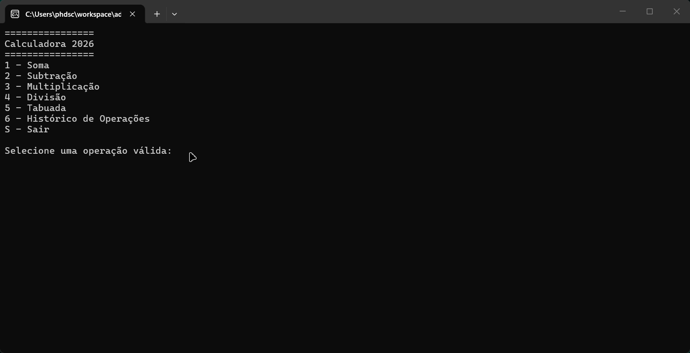

# Calculadora 2026


 
## Introdução
Uma calculadora de console simples, porém completa. Permite realizar as quatro operações matemáticas básicas, consultar o histórico de operações e acessar a tabuada diretamente pelo terminal.

## Funcionalidades
- **Operações básicas:** soma, subtração, multiplicação e divisão.
- **Tratamento de divisão por zero:** valida e impede divisões inválidas.
- **Tabuada:** consulta rápida de qualquer número.
- **Histórico de operações:** visualize os cálculos realizados durante a execução.

## Como utilizar

### 1. Clone o repositório
```bash
git clone <url-do-repositorio>
````

### 2. Abra o terminal e vá até a pasta raiz do projeto

```bash
cd nome-do-repositorio
```

### 3. Restaure as dependências do projeto

```bash
dotnet restore
```

### 4. Compile e execute o projeto

```bash
dotnet run --project Calculadora.ConsoleApp
```

## Requisitos

* **.NET SDK 10.0**

